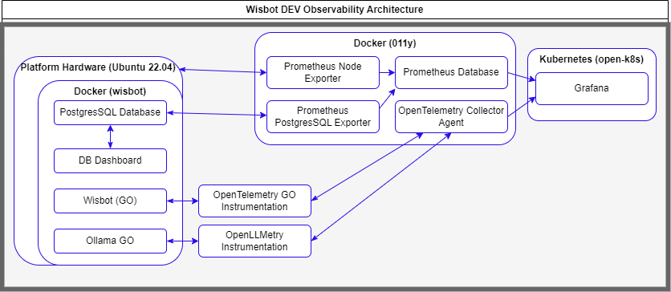

# o11y
Observability deployment resources for Uhstray.io

## Architecture



## Getting Started

Make sure you have [docker](https://docs.docker.com/engine/install/) installed...

Pull down this repository and navigate to the main `o11y` directory
```bash
git clone https://github.com/uhstray-io/o11y.git
cd ./o11y
```

Run docker compose

```bash
docker compose up -d
```

Navigate to the: 
- Grafana Dashboard at [http://localhost:3000](http://localhost:3000)
- Prometheus Dashboard at [http://localhost:9090](http://localhost:9090)
- Mimir Dashboard at [http://localhost:9009/](http://localhost:9009/)
- cAdvisor Dashboard at [http://localhost:9092/](http://localhost:9092/)

## Testing and Developing

Get the current logs from the deploymnet to triage

```bash
docker compose logs
```

Spin the current deployment down

```bash
docker compose down
```

Spin down the deployment and remove all volumes

```bash
docker compose down -v
```

Spin down the deployment and remove all images+volumes

```bash
docker compose down --rmi="all" -v
```

---

## TODO

- [ ] Upgrade Grafana to use Mimir Promtheus TSDB
- [ ] Develop OpenTelemetry Collector Process for Wisbot
- [ ] Deploy OpenTelemetry o11y collector integrated with Grafana
- [ ] Upgrade Alert Manager Storage to use Github Actions driven Secrets
  
```yaml
alertmanager_storage:
      backend: s3
      s3:
        access_key_id: {{ .Values.minio.rootUser }}
        bucket_name: {{ include "mimir.minioBucketPrefix" . }}-ruler
        endpoint: {{ template "minio.fullname" .Subcharts.minio }}.{{ .Release.Namespace }}.svc:{{ .Values.minio.service.port }}
        insecure: true
        secret_access_key: {{ .Values.minio.rootPassword }}
```

- [ ] Upgrade to Alloy Collector where necessary for production needs
- [ ] Migrate Mimir to Microservice Deployment Mode
- [ ] Determine Beyla eBPF Instrumentation Targets
- [ ] Add Pyroscope for Wisbot Profiling
- [ ] Setup relabeling to streamline service discovery | https://grafana.com/docs/loki/latest/send-data/promtail/scraping/

---

## Grafana

https://github.com/grafana/grafana

### Grafana Mimir

https://grafana.com/docs/mimir/latest/references/architecture/deployment-modes/

### Grafana Alloy

https://github.com/grafana/alloy

### Grafana Beyla

https://github.com/grafana/beyla?pg=oss-beyla&plcmt=hero-btn-2

### Grafana Pyroscope

https://github.com/grafana/pyroscope

---

## Prometheus

### Prometheus Database

https://prometheus.io/docs/prometheus/latest/installation/


### Prometheus Node Exporter

https://github.com/prometheus/node_exporter


### Promtail

https://grafana.com/docs/loki/latest/send-data/promtail/

https://github.com/grafana/loki/tree/main/clients/cmd/promtail


### Windows Exporter

https://github.com/prometheus/node_exporter


### Prometheus PostgreSQL Exporter

https://github.com/prometheus-community/postgres_exporter

---

## OpenTelemetry

### OpenTelemetry Collector

https://github.com/open-telemetry/opentelemetry-collector

https://opentelemetry.io/docs/specs/otlp/

https://opentelemetry.io/docs/collector/deployment/agent/

https://opentelemetry.io/docs/collector/installation/


### OTEL GO Instrumentation

https://opentelemetry.io/docs/languages/go/getting-started/

https://opentelemetry.io/docs/languages/go/instrumentation/

https://opentelemetry.io/docs/languages/go/exporters/

### OpenLLMetry Instrumentation

https://github.com/traceloop/openllmetry

https://www.traceloop.com/docs/openllmetry/getting-started-python
