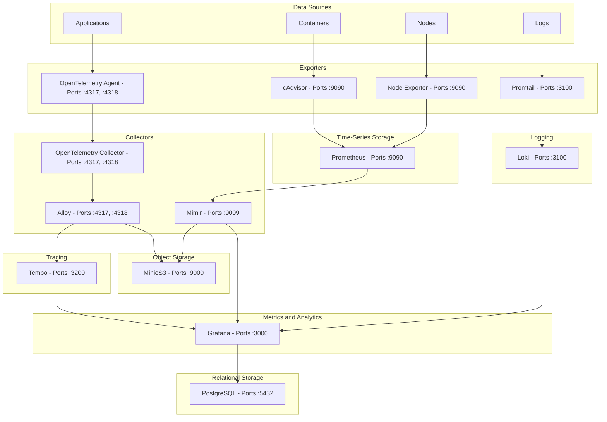

# o11y
Observability deployment resources for Uhstray.io

## Architecture



## Overview

This repository contains the deployment resources for our observability stack, including Grafana, Prometheus, Mimir, Tempo, Loki, and OpenTelemetry components. The stack provides comprehensive monitoring, logging, tracing, and metrics collection for Uhstray.io services.

## Contributing Guidelines

- [Review our Code of Conduct](https://www.uhstray.io/en/code-of-conduct)
- [Check our CONTRIBUTING.MD](./CONTRIBUTING.md)

## Getting Started

### Prerequisites

- [Docker](https://docs.docker.com/engine/install/) and Docker Compose installed
- Minimum recommended resources: 8 CPU cores, 16GB RAM

### Deployment

Pull down this repository and navigate to the main `o11y` directory:

```bash
git clone https://github.com/uhstray-io/o11y.git
cd ./o11y
```

Run docker compose:

```bash
docker compose up -d
```

### Accessing Dashboards

Navigate to the following dashboards:

- Grafana Dashboard: [http://localhost:3000](http://localhost:3000) (default credentials: admin/admin)
- Prometheus Dashboard: [http://localhost:9090](http://localhost:9090)
- Mimir Dashboard: [http://localhost:9009/](http://localhost:9009/)
- cAdvisor Dashboard: [http://localhost:9092/](http://localhost:9092/)
- Tempo UI: [http://localhost:3200](http://localhost:3200)
- Loki UI: [http://localhost:3100](http://localhost:3100)

## Testing and Developing

Get the current logs from the deployment to triage:

```bash
docker compose logs
```

Spin the current deployment down:

```bash
docker compose down
```

Spin down the deployment and remove all volumes:

```bash
docker compose down -v
```

Spin down the deployment and remove all images+volumes:

```bash
docker compose down --rmi="all" -v
```

## Troubleshooting

### Common Issues

1. **Services fail to start**: Check for port conflicts with `docker ps -a` and stop any conflicting services
2. **Out of memory errors**: Increase Docker memory allocation in Docker Desktop settings
3. **Permission issues**: Ensure proper file permissions for volume mounts

### Viewing Component Logs

```bash
# View logs for a specific service
docker compose logs grafana

# Follow logs live
docker compose logs -f prometheus
```

## Component Overview

### Metrics Collection
- **Prometheus**: Time-series database for storing metrics
- **Node Exporter**: Hardware and OS metrics collection
- **cAdvisor**: Container metrics collection
- **Mimir**: Scalable, long-term metrics storage

### Logs Management
- **Loki**: Log aggregation system
- **Promtail**: Log collection agent

### Tracing
- **Tempo**: Distributed tracing backend
- **OpenTelemetry Collector**: Trace collection and processing

### Visualization
- **Grafana**: Unified visualization platform for metrics, logs, and traces

## TODO

- [x] Initial deployment with Grafana, Prometheus, and exporters
- [ ] Upgrade Grafana to use Mimir Prometheus TSDB
- [ ] Develop OpenTelemetry Collector Process for Wisbot
- [ ] Deploy OpenTelemetry o11y collector integrated with Grafana
- [ ] Upgrade Alert Manager Storage to use GitHub Actions driven Secrets
  
```yaml
alertmanager_storage:
      backend: s3
      s3:
        access_key_id: {{ .Values.minio.rootUser }}
        bucket_name: {{ include "mimir.minioBucketPrefix" . }}-ruler
        endpoint: {{ template "minio.fullname" .Subcharts.minio }}.{{ .Release.Namespace }}.svc:{{ .Values.minio.service.port }}
        insecure: true
        secret_access_key: {{ .Values.minio.rootPassword }}
```

- [ ] Upgrade to Alloy Collector where necessary for production needs
- [ ] Migrate Mimir to Microservice Deployment Mode
- [ ] Determine Beyla eBPF Instrumentation Targets
- [ ] Add Pyroscope for Wisbot Profiling
- [ ] Setup relabeling to streamline service discovery | https://grafana.com/docs/loki/latest/send-data/promtail/scraping/
- [ ] Implement high availability configuration for production
- [ ] Add custom dashboards for Wisbot service monitoring

---

## Technology References

### Grafana Ecosystem
- [Grafana](https://github.com/grafana/grafana) - Visualization platform
- [Grafana Mimir](https://grafana.com/docs/mimir/latest/references/architecture/deployment-modes/) - Scalable metrics storage
- [Grafana Alloy](https://github.com/grafana/alloy) - Unified telemetry collector
- [Grafana Beyla](https://github.com/grafana/beyla) - eBPF-based auto-instrumentation
- [Grafana Pyroscope](https://github.com/grafana/pyroscope) - Continuous profiling

### Prometheus Ecosystem
- [Prometheus](https://prometheus.io/docs/prometheus/latest/installation/) - Metrics collection and storage
- [Node Exporter](https://github.com/prometheus/node_exporter) - System metrics collection
- [Promtail](https://grafana.com/docs/loki/latest/send-data/promtail/) - Log collector
- [Windows Exporter](https://github.com/prometheus-community/windows_exporter) - Windows metrics collection
- [PostgreSQL Exporter](https://github.com/prometheus-community/postgres_exporter) - PostgreSQL metrics

### OpenTelemetry
- [OpenTelemetry Collector](https://github.com/open-telemetry/opentelemetry-collector) - Telemetry collection
- [OTEL Protocol](https://opentelemetry.io/docs/specs/otlp/) - Telemetry protocol specification
- [OTEL GO Instrumentation](https://opentelemetry.io/docs/languages/go/getting-started/) - Go instrumentation
- [OpenLLMetry](https://github.com/traceloop/openllmetry) - LLM observability
